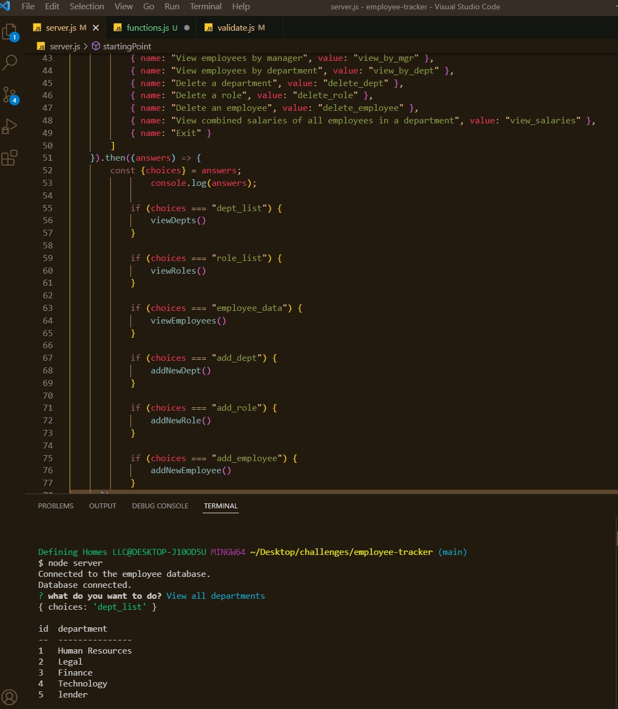
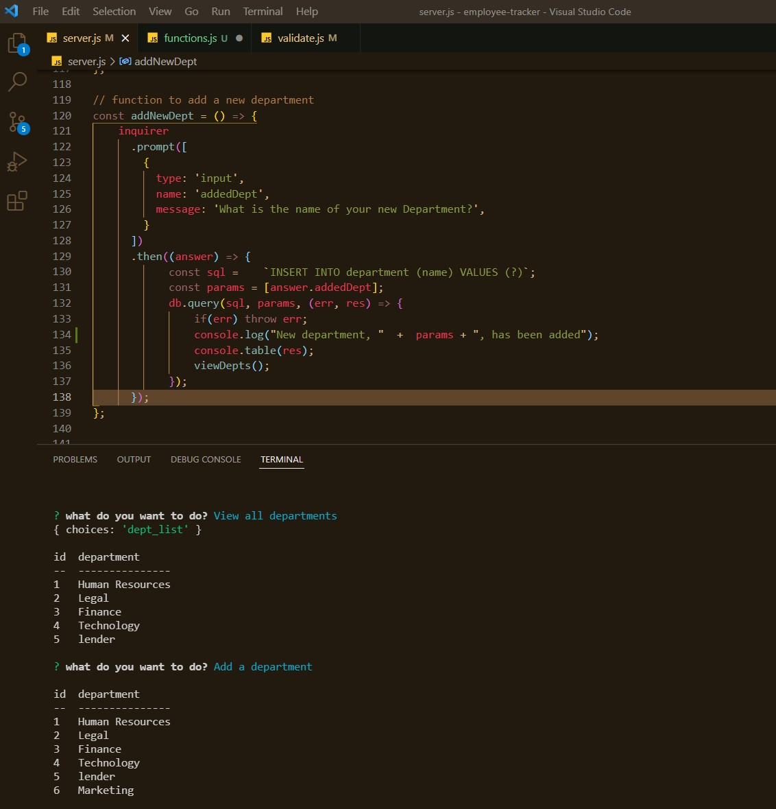

# employee-tracker

## Description

This command-line application was designed to manage a company's employee database. 

You may view the the walkthru video that demonstrates the application's functionality by [clicking this link](https://drive.google.com/file/d/1At5Xm6YSoIBygz9FV-6yjQz0F3XVwIa8/view).

**Technologies**  

The application was created by Node JS with the `Inquirer` and `MySQL2` and `console.table` packages.

**Criteria**

***User Story***
AS A business owner
I WANT to be able to view and manage the departments, roles, and employees in my company
SO THAT I can organize and plan my business

***Acceptance Criteria***
GIVEN a command-line application that accepts user input

WHEN I start the application
THEN I am presented with the following options: view all departments, view all roles, view all employees, add a department, add a role, add an employee, and update an employee role

WHEN I choose to view all departments
THEN I am presented with a formatted table showing department names and department ids

WHEN I choose to view all roles
THEN I am presented with the job title, role id, the department that role belongs to, and the salary for that role

WHEN I choose to view all employees
THEN I am presented with a formatted table showing employee data, including employee ids, first names, last names, job titles, departments, salaries, and managers that the employees report to

WHEN I choose to add a department
THEN I am prompted to enter the name of the department and that department is added to the database

WHEN I choose to add a role
THEN I am prompted to enter the name, salary, and department for the role and that role is added to the database

WHEN I choose to add an employee
THEN I am prompted to enter the employee’s first name, last name, role, and manager, and that employee is added to the database

WHEN I choose to update an employee role
THEN I am prompted to select an employee to update and their new role and this information is updated in the database

**Accomplishment**
The application successfully allows a user to interact with the database as required. The following options were updated and are now working in version 1.1:
- The option to create a new role works, as the new role prints to the table, as intended;
- the option to update an employee's data has been added.

**Below are a screenshots of the app showing the functionality:**

Below are images of how the term looks **when the app is run**, showing user-generated input  
 
  
 
  

## Contributing

## Credits

**The following resources were used to complete this project:**
1. UCONN Coding Bootcamp's modules on Javascript and Node JS
2. README Guide [How to create a Professional README](./readme-guide.md)
3. [NodeJs](https://nodejs.org/api/modules.html) Documentation 
4. [Inquirer](https://www.npmjs.com/package/inquirer/v/8.2.0) Documentation 
5. [MySQL2](https://www.npmjs.com/package/mysql2) Documentation 
6. A lot of the server.js/Inquirer code is credited to [this repo](https://github.com/jpd61/employee-tracker) which helped a lot!

## License

